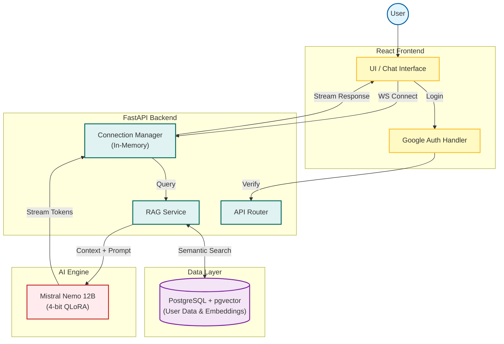

# LegalGPT Nepal 🇳🇵⚖️


**LegalGPT Nepal** is an AI-powered legal advisory system designed to democratize access to legal information for Nepalese citizens. Developed as a **Final Year Computer Engineering Project**, it utilizes Retrieval-Augmented Generation (RAG) to provide accurate, context-aware answers based on the Constitution and Laws of Nepal.

---

## 🚀 Key Features

*   **AI Legal Assistant:** Powered by a fine-tuned **Mistral Nemo 12B** model to answer legal queries.
*   **High-Performance Backend:** Built with **FastAPI** for native asynchronous processing and high-speed WebSocket streaming.
*   **RAG Architecture:** Uses `pgvector` to retrieve relevant legal documents (IIO format) before answering, ensuring high accuracy.
*   **Real-Time Streaming:** Instant token-by-token responses via WebSockets.
*   **Secure Authentication:** Google OAuth 2.0 integration with JWT session management.
*   **Citations:** Every AI response includes references to the specific articles or legal documents used.

---

## 🏗️ System Architecture

The system follows a modern full-stack architecture optimized for async AI operations.



---

## 🛠️ Tech Stack

| Component | Technology | Details |
| :--- | :--- | :--- |
| **Frontend** | React.js | Vite, Tailwind CSS, TanStack Query |
| **Backend** | FastAPI | Python Async, Pydantic, Uvicorn |
| **Database** | PostgreSQL | `pgvector` extension for Vectors & JSONB |
| **AI Model** | Mistral Nemo 12B | 4-bit QLoRA quantization, Unsloth |
| **Auth** | OAuth 2.0 | Google Sign-In + JWT |
---

## 📂 Repository Structure

This project utilizes a **Monorepo** structure:

```text
LegalGPT-Nepal/
├── backend/            # FastAPI Application
│   ├── app/
│   │   ├── api/        # REST & WebSocket Routes
│   │   ├── core/       # Config, Security, DB setup
│   │   ├── services/   # RAG & AI Logic
│   │   └── main.py     # Entry Point
│   ├── alembic/        # DB Migrations
│   └── requirements.txt
├── frontend/           # React User Interface
├── ai_engine/          # Notebooks for Fine-tuning & RAG Pipeline
├── data/               # Raw and Processed Legal Datasets
└── docs/               # Project Documentation & Diagrams
```

---

## ⚡ Getting Started

Follow these instructions to set up the project locally.

### Prerequisites
*   Python 3.10+
*   Node.js & npm
*   PostgreSQL (with pgvector installed)

### 1. Backend Setup (FastAPI)

```bash
cd backend
python -m venv venv
# Activate venv: source venv/bin/activate (Mac/Linux) or venv\Scripts\activate (Windows)

pip install -r requirements.txt

# Create .env file based on .env.example
# Ensure DB credentials are set

# Run Database Migrations (if using Alembic)
alembic upgrade head

# Start the Server
uvicorn app.main:app --reload
```
*The API Documentation will be available at `http://localhost:8000/docs`*

### 2. Frontend Setup (React)

```bash
cd frontend
npm install
npm run dev
```

### 3. AI Engine Setup
*Note: You need an NVIDIA GPU (T4 or RTX series) to run the quantization scripts efficiently.*

```bash
cd ai_engine
pip install -r requirements.txt
# Run the notebooks/ scripts to preprocess data or test the model
```

---

## 👥 The Team

| Name | Role | Responsibility |
| :--- | :--- | :--- |
| **Nishan Bhattrai** | Backend Lead | FastAPI Architecture, DB Design, Auth |
| **Rajat Pradhan** | Frontend Lead | React UI/UX, Component Design |
| **Prasanga Niraula** | AI Lead | Model Selection, Fine-tuning, RAG |
| **Yamraj Khadka** | Research Lead | Legal Data Collection, Testing, Documentation |

---

## 📝 License

This project is licensed under the MIT License - see the [LICENSE](LICENSE) file for details.

*Submitted as a fulfillment of the Final Year Project, Bachelor of Computer Engineering.*